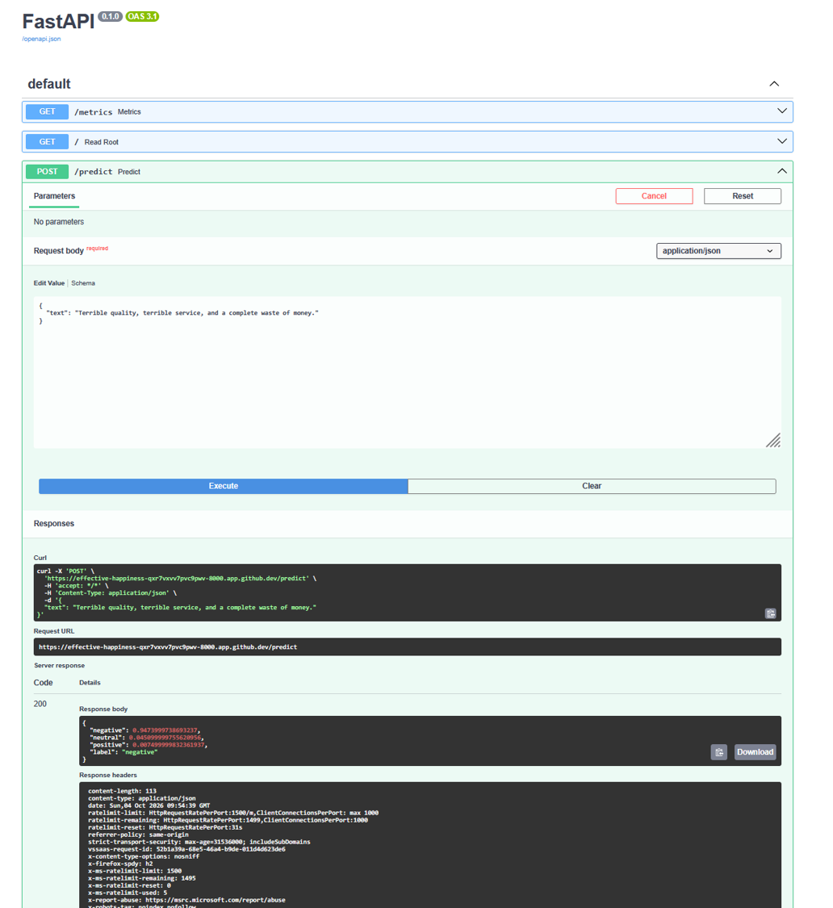
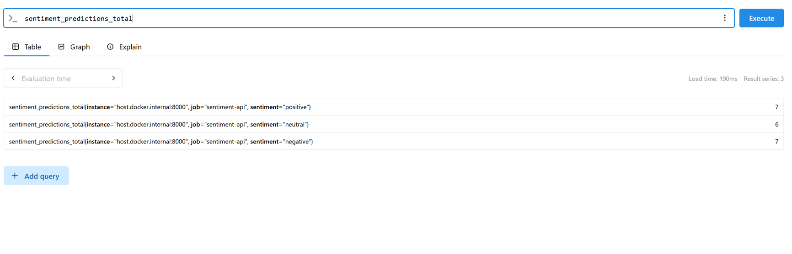
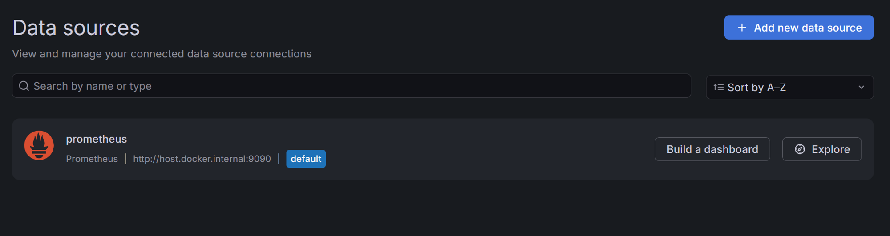
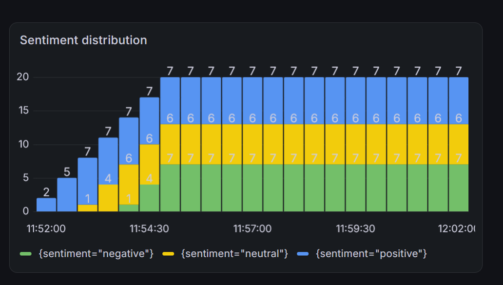
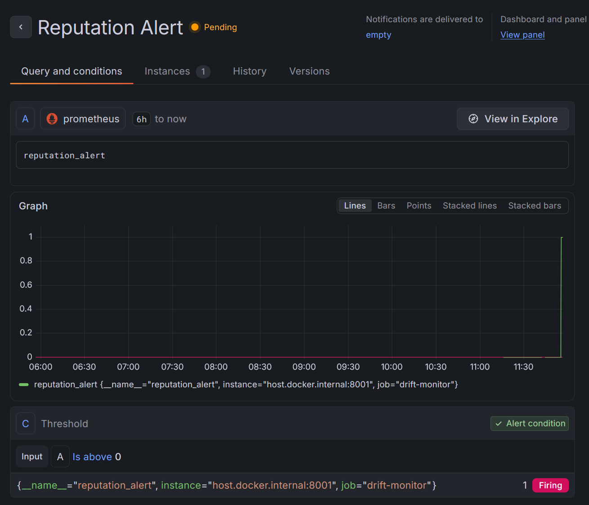
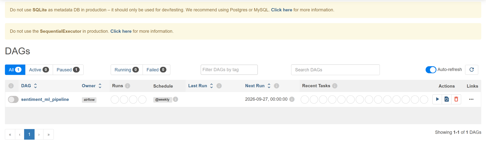
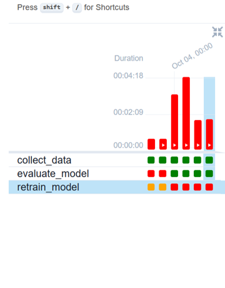

We used cardiffnlp/twitter-roberta-base-sentiment-latest, a RoBERTa-based model fine-tuned for sentiment analysis. We tested its basic accuracy, which is aroung 75%.

**WORKFLOW:** 

The main workflow is:

Text input
    
    ↓

FastAPI
    
    ↓

Sentiment prediction
   
    ↓

Prometheus metrics
    
    ↓

Grafana dashboard

**FastAPI**

FastAPI provides an API endpoint for sending text to the sentiment analysis model.

The API returns the predicted sentiment.

**MONITORING**

- Prometheus

    Prometheus collects metrics generated by the application (*sentiment_total_distribution* and *reputation_negative*). When *reputation_negative* is lower than 30% over the total sentiments, the *reputation_alert*      is set to 0. Otherwise, is set to 1.

    The monitored information includes the sentiment predictions produced by the model.

    

- Grafana

    Grafana is connected to Prometheus and provides two different visual dashboards

    

    First dashboard: sentiment distribution
  
    

    Second dashboard: Alert status through the definition of an alert rule on grafana according to the rule we have defined before.

    The alert is designed to identify an undesirable change in the sentiment distribution; an alert rule is set on Grafana.
    This demonstrates how monitoring can be extended from simple visualization to automatic alerting.

    

**AIRFLOW**

Airflow is used to orchestrate the ML workflow.

The DAG contains the main steps required by the pipeline and provides a visual representation of their execution.

This makes the workflow easier to monitor and reproduce.

During the execution of the Airflow pipeline, two issues were encountered:

    DNS/network issue: Airflow was unable to reliably access the external Hugging Face resources due to DNS resolution problems. This prevented the model from being downloaded or accessed consistently from the            external repository.
    
    Memory limitation: A retraining task failed because the available memory was not sufficient to complete the process.

**Deployment**

The project includes an automated deployment step to Hugging Face, triggered by GitHub Actions after changes are pushed to the `main` branch. The deployment script (`deploy_to_hf.py`) uses GitHub repository secrets to authenticate with Hugging Face and identify the target repository.

